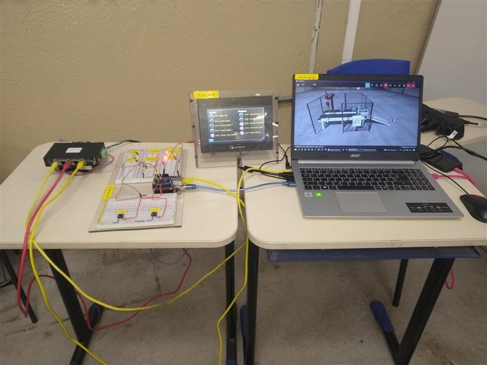

# Integração de arduino com IHM e FACTORY I/O
---

## Lista de equipamentos:

1.  1 Arduino UNO
2.  1 Ethernet Shield W5100
3.  6 Resistores 300 OHM
4.  6 Leds 5 volts
5.  2 Push Button
6.  1 Protoboard
7.  Cabos e Jumpers
8.  1 IHM Modelo WEINTEK MT807ip de 7"
9.  1 Switch de rede industrial
10.  Cabos de rede
11.  1 Fonte de alimentação bivolt com saída de 24 vcc
12.  Simulador de fabrica "FACTORY I/O"
13.  Notebook
14.  Cabo HDMI
---



## Descrição do projeto

O projeto tem como objetivo integrar o Arduino com a IHM e o software FACTORY I/O, utilizando protocolo de comunicação Modbus Ethernet através das portas RJ45 dos nossos equipamentos. Com tudo configurado e funcionando, foi o possível demonstrar as grandes características didáticas embarcadas do FACTORY I/O, trazendo a possibilidade de simular equipamentos industriais tais como sensores, esteiras, atuadores, botões, sinaleiros, motores etc. O projeto foi um sucesso, funcionou como planejado, conseguimos demonstrar a virtualização de maneira muito realista sendo possível comandar e monitorar dados através da nossa IHM, que é um equipamento físico, nossos botões e leds que também eram componentes físicos, gerando redundância de 3 possibilidades de controle também sendo funcional pelo painel do operador agregado no software simulador de fábrica. Com tudo dito, foi possível ligar e desligar o processo virtual através da IHM, botão ligado no Arduino e botões virtuais. O mesmo para monitorar os dados do processo como os inputs e outputs, havendo possibilidade de monitorar pela IHM física, pelos leds físicos na protoboard e pelo FACTORY I/O virtual. A construção do projeto exigiu muito de todos os parceiros do grupo, trazendo como consequência grandes conhecimentos para nossa evolução. 

---
## Código do programa

```

#include <SPI.h>
#include <Ethernet.h>
#include "MgsModbus.h"

MgsModbus Mb;
//MgsModbus FC;


// Ethernet settings (depending on MAC and Local network)
byte mac[] = {0x90, 0xA2, 0xDA, 0x0E, 0x94, 0xB5 };
IPAddress ip(192, 168, 0, 30);
IPAddress gateway(192, 168, 0, 1);
IPAddress subnet(255, 255, 255, 0);


//word Coil;
int contador=0;
int contador1=0;
int contador2=0;
int contador3=0;
int contador4=0;
int contadorproceso=0;
int contadorproceso3=0;
int cont=0;
int contadParo=0;


void setup(){
  
  Serial.begin(9600);
  pinMode(7,OUTPUT);
  pinMode(6,OUTPUT);
  pinMode(5,OUTPUT);
  pinMode(8,OUTPUT);
  pinMode(9,OUTPUT);
  
  Ethernet.begin(mac, ip, gateway, subnet);  
  
}

void loop(){
  
  Mb.MbData[0] = 0;
  
  while(true){

  // TAGS SENSORES DO CLP FACTORY IO
  digitalWrite(6,bitRead( Mb.GetBit(0x00),0));// CLP FACTORY IO - START
  digitalWrite(7,bitRead( Mb.GetBit(0x01),0));// CLP FACTORY IO - STOP
  digitalWrite(5,bitRead( Mb.GetBit(0x02),0));// CLP FACTORY IO - ITEM AT ENTRY
  digitalWrite(8,bitRead( Mb.GetBit(0x03),0));// CLP FACTORY IO - ITEM AT EXIT
  digitalWrite(9,bitRead( Mb.GetBit(0x04),0));// CLP FACTORY IO - ITEM DETECTED
 

  
  
  if(digitalRead(7)==1 ){ // BOTAO STOP = 1
    contadParo=5;
  }
  if(digitalRead(6)==1){ // BOTAO STAART  = 1
    contadParo=0;
   
  }
  
  Serial.println(contadParo);
  if((digitalRead(6)==1||digitalRead(8)==1||contador==1)&&contadParo==0  ) { // SE "START" OU "SENSOR DE SAIDA " OU "CONTADOR=1"
    Mb.SetBit(0x06,true); // ESTEIRA 1 - LIGA
    contador=1;
    contadorproceso=0;
  }

  
  if(digitalRead(5)==1||contador1==1){ // SE "SENSOR DE ENTRADA" OU CONTADOR1=1
    Mb.SetBit(0x07,true);// Z - AVANÇA
    Mb.SetBit(0x06,false);// ESTEIRA 1 - DESLIGA
    contador=0;
    contador1=1;
  }

  
  if(digitalRead(9)==1||contador2==1){ // SE SENSOR ITEM DETECTADO OU CONTADOR 2 = 1
    Mb.SetBit(0x09,true);// VACUO - LIGA
    delay (2);
    Mb.SetBit(0x07,false); //  Z - RECUA
     delay (2);
    Mb.SetBit(0x08,true); // X - AVANÇA
     delay (2);
    contador1=0;
    contador2=1;
    contadorproceso=contadorproceso+1;
  }

  
  if(contadorproceso>=650){ // ENQUANTO FOR MENOR QUE 550 AGUARDA
    contador2=0;
    Mb.SetBit(0x09,false); // DESLIGA VACUO
    
  }

  
  if(digitalRead(8)==1||contador3==1){
    Mb.SetBit(0x0A,true); // ESTEIRA 2 - LIGA 
    contador3=1;
  }
  Mb.MbsRun();
  }
}
```
